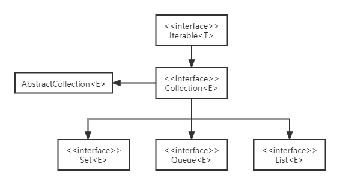
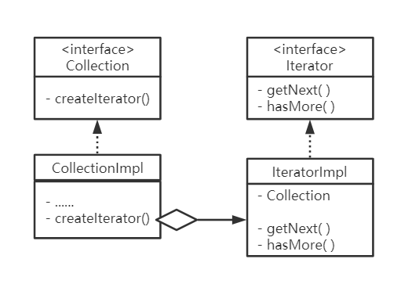

### 【java基础】Java容器概览

Java容器是Java中用来存储数据的一系列数据结构的统称，与另一个常用的存储结构数组相比，Java容器

- 长度可变
- 只能存储引用数据类型

#### 1. 容器框架

在Java容器框架中，有关Collection的类图结构如下



主要包含三类数据结构，

- Collection，一系列独立元素的序列
  - List，按顺序保存元素
  - Set，不能有重复元素
  - Queue，按队列规则确定保存元素顺序

#### 2. Collection接口

Collection接口是结合框架的根接口，标识了集合所通用的系列方法

```java
public interface Collection<E> extends Iterable<E> {
    int size();
    boolean isEmpty();
    boolean contains(Object o);
    Iterator<E> iterator();
    Object[] toArray();
    <T> T[] toArray(T[] a);
    default <T> T[] toArray(IntFunction<T[]> generator);
    boolean add(E e);
    boolean remove(Object o);
    boolean containsAll(Collection<?> c);
    boolean addAll(Collection<? extends E> c);
    boolean removeAll(Collection<?> c);
    default boolean removeIf(Predicate<? super E> filter);
    boolean retainAll(Collection<?> c);
    void clear();
    boolean equals(Object o);
    int hashCode();
    default Spliterator<E> spliterator();
    default Stream<E> stream();
    default Stream<E> parallelStream();
}
```

##### 2.1 扩展接口

Collection接口扩展了Iterable接口，iterable接口源码如下，

```java
public interface Iterable<T> {
    Iterator<T> iterator();
    default void forEach(Consumer<? super T> action) {
        Objects.requireNonNull(action);
        for (T t : this) {
            action.accept(t);
        }
    }
    default Spliterator<T> spliterator() {
        return Spliterators.spliteratorUnknownSize(iterator(), 0);
    }

}
```

iterable接口提供了方法iterator，用于返回迭代器Iterator，其源码如下，

```java
public interface Iterator<E> {
    boolean hasNext();
    E next();
    default void remove() {
        throw new UnsupportedOperationException("remove");
    }
     default void forEachRemaining(Consumer<? super E> action) {
        Objects.requireNonNull(action);
        while (hasNext())
            action.accept(next());
    }
}
```

实现了Iterable接口的类可以通过迭代器对序列元素进行迭代，这其实是设计模式中的迭代器模式，模型类图如下，



##### 2.2 包含方法

- **toArray**

toArray方法用于将集合转为数组，总共有三种toArray方法，此处重点介绍第三种,

```java
default <T> T[] toArray(IntFunction<T[]> generator) {
    return toArray(generator.apply(0));
}
```

IntFunction是一个接口，实现了此接口的类拥有一个apply方法，此处可以理解为自定义一个方法对集合中的每个元素执行并将处理后的元素存入数组中进行返回。

- **removeIf**

removeIf方法用于删除集合中满足某一filter的元素，

```java
default boolean removeIf(Predicate<? super E> filter) {
    Objects.requireNonNull(filter);
    boolean removed = false;
    final Iterator<E> each = iterator();
    while (each.hasNext()) {
        if (filter.test(each.next())) {
            each.remove();
            removed = true;
        }
    }
    return removed;
}
```

Predicate是一个接口，实现了test方法，用于检测某个输入值是否满足某一个要求

- **retainAll**

retainAll方法传入一个集合作为参数，删除当前集合中没有包含在参数集合中的元素

- **clear**

clear方法，删除集合中的所有元素

#### 3. AbstractCollection抽象类

AbstractCollection抽象类实现了Collection接口，为其中的部分方法提供了默认实现

- 实现不可变集合时，只需要继承该类，然后提供迭代器和size方法的实现
- 实现可变集合时，还需要重写add方法，迭代器也需要实现remove方法

```java
public abstract class AbstractColleciton<E> implements Collection<E> {
    protected AbstractCollection();
    public abstract Iterator<E> iterator();
    public abstract int size();
    public boolean isEmpty();
    public boolean contains(Object o);
    public Object[] toArray();
    public <T> T[] toArray(T[] a);
    private static <T> T[] finishToArray(T[] r, Iterator<?> it);
    public boolean add(E e);
    public boolean remove(Object o);
    public boolean containsAll(Collection<?> c);
    public boolean addAll(Collection<? extends E> c);
    public boolean removeAll(Collection<?> c);
    public boolean retainAll(Collection<?> c);
    public void clear();
    public String toString();
}
```

##### 3.1 包含方法

- **toArray**

AbstractCollection类实现了Collection接口中没有作默认实现的两个toArray方法，通过有finishToArray方法，处理数组长度小于容器元素数量的情况

```java
public Object[] toArray() {
    Object[] r = new Object[size()];  // 删除一个长度为集合size的数组
    Iterator<E> it = iterator();
    for (int i = 0; i < r.length; i++) {
        // 如果集合遍历完了，则直接返回Array
        if (!it.hasNext())
            return Arrays.copyOf(r, i);
        r[i] = it.next();
    }
    // 如果集合还hasNext，则调用finishaToArray方法
    return it.hasNext() ? finishToArray(r, it) : r;
}

public <T> T[] toArray(T[] a) {
    int size = size();
    // 如果传入数组的长度比集合size大，则r=传入数组
    // 否则，生成一个a同类型的和size一样大的数组赋值给r
    T[] r = a.length >= size ? a :
    (T[])java.lang.reflect.Array
        .newInstance(a.getClass().getComponentType(), size);
    Iterator<E> it = iterator();

    for (int i = 0; i < r.length; i++) {
        // 如果集合遍历完了
        if (!it.hasNext()) { 
            if (a == r) {
                // 如果a==r则表示a的长度大于size
                // 数组中集合元素的后一个位置为null
                r[i] = null; 
            } else if (a.length < i) {
                // 如果a的长度小于i，则表示r是根据集合size生成的数组，直接返回
                return Arrays.copyOf(r, i);
            } else {
                System.arraycopy(r, 0, a, 0, i);
                // 数组中集合元素的后一个位置为null
                if (a.length > i) {
                    a[i] = null;
                }
            }
            return a;
        }
        r[i] = (T)it.next();
    }
    // 如果集合还hasNext，则调用finishaToArray方法
    return it.hasNext() ? finishToArray(r, it) : r;
}

// 动态扩大数组，并将迭代器迭代的值存入扩大的数组中
private static <T> T[] finishToArray(T[] r, Iterator<?> it) {
    int len = r.length;
    int i = len;
    while (it.hasNext()) {
        if (i == len) {
            // 扩大数组，
            len = ArraysSupport.newLength(len,
                                          1, /*最小扩大长度*/ 
                                          (len >> 1) + 1 /*希望扩大长度*/);
            r = Arrays.copyOf(r, len);
        }
        r[i++] = (T)it.next();
    }
    return (i == len) ? r : Arrays.copyOf(r, i);
}
```

- **add**

add方法虽然不是抽象方法，但是也没有作实现，而是直接抛出不支持操作的警告

```java
public boolean add(E e) {
    throw new UnsupportedOperationException();
}
```

- **remove**

remove方法实际就是在调用迭代器的remove方法

```java
public boolean remove(Object o) {
    Iterator<E> it = iterator();
    // 因为null无法调用equals方法
    if (o==null) {
        while (it.hasNext()) {
            if (it.next()==null) {
                it.remove();
                return true;
            }
        }
    } else {
        while (it.hasNext()) {
            if (o.equals(it.next())) {
                it.remove();
                return true;
            }
        }
    }
    return false;
}
```

- **containAll** | **addAll**

containAll和addAll方法就是遍历传入集合，调用contian|add方法
