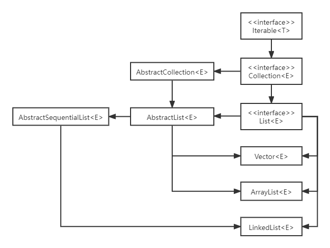

### 【java基础】List

List是Collection的一种，用于存储一系列有序的元素

#### 1. List概览

在Java中中，有关List的类图结构如下



List主要有3种实现，

- ArrayList，使用动态数据方式是实现的List
  - 存在容量限制，需要扩容
  - 随机访问快
  - 随机插入、删除慢
- LinkedList，使用双向链表结构实现的List
  - 不存在容量限制
  - 随机访问慢
  - 随机插入、删除快
- Vector，线程安全的List
  - 与ArrayList类似
  - 其中的主要方法都是synchronized方法

#### 2. List接口

List接口是List系列的根接口，标识了List所通用的系列方法，扩展了Collection接口

```java
public interface List<E> extends Collection<E> {
    int size();
    boolean isEmpty();
    boolean contains(Object o);
    Iterator<E> iterator();
    Object[] toArray();
    <T> T[] toArray(T[] a);
    boolean add(E e);
    boolean remove(Object o);
    boolean containsAll(Collection<?> c);
    boolean addAll(Collection<? extends E> c);
    boolean addAll(int index, Collection<? extend E> c)
    boolean removeAll(Collection<?> c);
    boolean retainAll(Collection<?> c);
    default void replaceAll(UnaryOperator<E> operator);
    default void sort(Comparator<? super E> c);
    void clear();
    boolean equals(Object o);
    int hashCode();
    E get(int index);
    E set(int index, E element);
    void add(int index, E element);
    E remove(int index);
    int indexOf(Object o);
    int lastIndexOf(Object o);
    ListIterator<E> listIterator();
    ListIterator<E> listIterator(int index);
    List<E> subList(int fromIndex,int toIndex);
    default Spliterator<E> spliterator();
    static <E> List<E> of(E... elements);
    static <E> List<E> copyOf(Collection<? extend E> coll);
}
```

##### 2.1 接口概述

List接口描述了一个有序集合（也可以叫做序列），用户可以

- 控制每个元素在List中的插入位置
- 通过整数索引访问元素
- 在List中搜索元素

##### 2.2 方法

- **addAll**

LIst接口提供了两种addAll方法，后一种方法如下

```java
boolean addAll(int index, Collection<? extends E> c);
```

方法传入两个参数，其中第一个参数index用于指示插入的位置

- **replaceAll**

replaceAll方法用于对List中的每一元素执行某一操作

```java
default void replaceAll(UnaryOperator<E> operator) {
    Objects.requireNonNull(operator);
    final ListIterator<E> li = this.listIterator();
    while (li.hasNext()) {
        li.set(operator.apply(li.next()));
    }
}
```

UnaryOperator是一个接口，实现了apply方法，用于执行某一操作

- **sort**

sort方法对List中的元素进行排序

```java
default void sort(Comparator<? super E> c) {
    Object[] a = this.toArray();
    Arrays.sort(a, (Comparator) c);
    ListIterator<E> i = this.listIterator();
    for (Object e : a) {
        i.next();
        i.set((E) e);
    }
}
```

实际就是先将List转为Array，然后调用Array的sort方法，然后再转回来，而Array中的排序是一种改进的归并排序

- **indexOf**和**lastIndexOf**

List提供了两种取得对应对象在List中序号的方法

```java
int indexOf(Object o);
int lastIndexOf(Object o);
```

 分别取得第一个和o相等的元素的序号和最后一个和o相等的元素的序号

- **listIterator**

List实现了自己的迭代器ListIterator

```java
public interface ListIterator<E> extends Iterator<E> {
	boolean hasNext();
    E next();
    boolean hasPrevious();
    E previous();
    int nextIndex();
    int previousIndex();
    void remove();
    void set(E e);
    void add(E e);
}
```

不止可以取得next的元素，也可以取得前一个元素pervious，还可以通过set和add方法进行修改，该迭代器可以通过两个方法取得

```java
ListIterator<E> listIterator();
ListIterator<E> listIterator(int index);
```

其中后一个方法取得指定index的迭代器

- **of**和**copyOf**

List有of和copyOf方法用于生成不可修改的List，这系列方法都是静态方法

```java
static <E> List<E> of(E... elements) {
    switch (elements.length) { 
        case 0:
            @SuppressWarnings("unchecked")
            var list = (List<E>) ImmutableCollections.EMPTY_LIST;
            return list;
        case 1:
            return new ImmutableCollections.List12<>(elements[0]);
        case 2:
            return new ImmutableCollections.List12<>(elements[0], elements[1]);
        default:
            return ImmutableCollections.listFromArray(elements);
    }
}    
static <E> List<E> copyOf(Collection<? extends E> coll) {
    return ImmutableCollections.listCopy(coll);
}
```

实际都是调用ImmutableCollections中的方法，一个不可修改的List（Unmodifiable List）满足以下条件

- 不可修改，调用添加、删除等方法都会抛出UnsupportedOperationException
- 不允许空元素
- 如果元素可序列化，则可序列化
- 顺序于参数或数组顺序相同

#### 3. AbstractList抽象类

AbstractList抽象类继承自AbstractCollection抽象类，实现了List接口

- 需要注意的是，该类实现的是随机访问（如ArrayList）的接口，对于顺序访问（如LinkedList），应考虑AbstractSequentialList抽象类

- 实现不可变List时，只需要继承该类，然后提供get和size方法的实现
- 实现可变List时，还需要重写set、add和remove方法
- 不必提供迭代器实现，迭代器由该类在get等方法的基础上自己实现

```java
public abstract class AbstractList<E> extends AbstractCollection<E> implements List<E> {
    protected AbstractList();
    public boolean add(E e);
    public abstract E get(int index);
	public E set(int index, E element);
    public void add(int index, E element);
    public E remove(int index);
    public int indexOf(Object o);
    public int lastIndexOf(Object o);
    public void clear();
    public boolean addAll(int index, Collection<? extends E> c);
    public Iterator<E> iterator();
    public ListIterator<E> listIterator();
    public ListIterator<E> listIterator(final int index);
    private class Itr implements Iterator<E> {}
    private class ListItr extends Itr implements ListIterator<E> {}
    public List<E> subList(int fromIndex, int toIndex);
    static void subListRangeCheck(int fromIndex, int toIndex, int size);
    public boolean equals(Object o);
 	public int hashCode();
    protected void removeRange(int fromIndex, int toIndex);
    private void rangeCheckForAdd(int index);
    private String outOfBoundsMsg(int index);
    static final class RandomAccessSpliterator<E> implements Spliterator<E> {}
    private static class SubList<E> extends AbstractList<E> {}
    private static class RandomAccessSubList<E> extends SubList<E> implements RandomAccess {}
}
```

##### 3.1 方法

- **add**

AbstractList中有两个add方法

```java
public boolean add(E e) {
    add(size(), e);
    return true;
}
public void add(int index, E element) {
    throw new UnsupportedOperationException();
}
```

第一个方法添加元素到List的末尾，通过调用第二个方法实现，默认抛出UnsupportedOperationException

- **indexOf**和**lastIndexOf**

AbstractList中的indexOf和lastIndexOf方法和AbstractCollection中的同名方法实现类似，只是List中通过ListIterator迭代器实现

```java
public int indexOf(Object o) {
    ListIterator<E> it = listIterator();
    if (o==null) {
        while (it.hasNext())
            if (it.next()==null)
                return it.previousIndex();
    } else {
        while (it.hasNext())
            if (o.equals(it.next()))
                return it.previousIndex();
    }
    return -1;
}
public int lastIndexOf(Object o) {
    ListIterator<E> it = listIterator(size());
    if (o==null) {
        while (it.hasPrevious())
            if (it.previous()==null)
                return it.nextIndex();
    } else {
        while (it.hasPrevious())
            if (o.equals(it.previous()))
                return it.nextIndex();
    }
    return -1;
}
```

- **iterator**和**listIterator**

分别返回新创建的Itr对象和listIterator对象

```java
public Iterator<E> iterator() {
        return new Itr();
}
public ListIterator<E> listIterator() {
    return listIterator(0);
}
public ListIterator<E> listIterator(final int index) {
    rangeCheckForAdd(index); // 检查index是否小于0或者大于size()
    return new ListItr(index);
}
```

- **subList**

返回指定的子List，对子List的修改直接反映在原List中

```java
public List<E> subList(int fromIndex, int toIndex) {
    subListRangeCheck(fromIndex, toIndex, size()); // 检查传入的参数是否合法
    return (this instanceof RandomAccess ?
            new RandomAccessSubList<>(this, fromIndex, toIndex) :
            new SubList<>(this, fromIndex, toIndex));
}
```

##### 3.2 内置对象

- **Itr**

AbstractList内置的Itr类，实现了Iterator接口，源码如下，

```java
private class Itr implements Iterator<E> {
    int cursor = 0; // next方法将要返回的元素的索引
    int lastRet = -1; // 最近一次调用next或pervious方法返回的元素的索引
    int expectedModCount = modCount; // modCount表示List结构修改的次数，本变量用于检查并发错误
	public boolean hasNext();
    public E next();
    public void remove();
    final void checkForComodification();
}
```

- **ListItr**

继承了Itr类，实现了ListIterator接口，相比Itr，增加了如下方法

```java
private class ListItr extends Itr implements ListIterator<E> {
    ListItr(int index); // 将cursor指向传入的index
    public boolean hasPrevious();
    public E previous();
    public int nextIndex();
    public int previousIndex();
    public void set(E e);
    public void add(E e);
}
```

- **SubList**

继承了AbstractList类，

```java
private static class SubList<E> extends AbstractList<E>
```

有如下属性

```java
private final AbstractList<E> root; // 产生此SubList的List
private final SubList<E> parent; // 如果从另一SubList生成SubList，此属性标记父SubList
private final int offset; // 在root中的开始位置
protected int size;
```

重写了系列方法包括List迭代器，大都是调用root的方法

- **RandomAccessSubList**

继承了SubList类，实现了RandomAccess接口，此接口是一个标记接口，无实质内容，标记实现它的类支持快速随机访问

#### 4. AbstractSequentialList

AbstractSequentialList类继承自AbstractList类，主要实现了一些顺序访问相关的操作，这些操作大都基于listIterator实现，例如

```java
public E get(int index) {
    try {
        return listIterator(index).next();
    } catch (NoSuchElementException exc) {
        throw new IndexOutOfBoundsException("Index: "+index);
    }
}

public E set(int index, E element) {
    try {
        ListIterator<E> e = listIterator(index);
        E oldVal = e.next();
        e.set(element);
        return oldVal;
    } catch (NoSuchElementException exc) {
        throw new IndexOutOfBoundsException("Index: "+index);
    }
}
```

#### 5. ArrayList

ArrayList是最常用的List之一，它

- 基于动态数组实现
- 存在容量限制，在元素数量超过容量时会自动扩容
- 随机访问快，插入、删除慢
- 不是线程安全的

```java
public class ArrayList<E> extends AbstractList<E>
        implements List<E>, RandomAccess, Cloneable, java.io.Serializable
```

##### 5.1 属性

- **DEFAULT_CAPACITY**

```java
private static final int DEFAULT_CAPACITY = 10;
```

默认初始容量为10，ArrayList有容量限制，当元素数超过容量限制时，会法

- **elementData**

```java
transient Object[] elementData;
```

用于存储ArrayList中的元素，对于空ArrayList，elementData==默认空数组，即下面这个属性

```java
private static final Object[] DEFAULTCAPACITY_EMPTY_ELEMENTDATA = {};
```

- **size**

```java
private int size;
```

ArrayList元素的数量

##### 5.2 方法

- **构造方法**

ArrayList共有三个构造方法，分别如下

```java
// 构造指定size的List
public ArrayList(int initialCapacity) {
    if (initialCapacity > 0) {
        this.elementData = new Object[initialCapacity];
    } else if (initialCapacity == 0) {
        this.elementData = EMPTY_ELEMENTDATA;
    } else {
        throw new IllegalArgumentException("Illegal Capacity: "+
                                           initialCapacity);
    }
}

// 构造空List
public ArrayList() {
        this.elementData = DEFAULTCAPACITY_EMPTY_ELEMENTDATA;
} 

// 根据传入集合构造List
public ArrayList(Collection<? extends E> c) {
    Object[] a = c.toArray();
    if ((size = a.length) != 0) {
        if (c.getClass() == ArrayList.class) {
            elementData = a;
        } else {
            elementData = Arrays.copyOf(a, size, Object[].class);
        }
    } else {
        // replace with empty array.
        elementData = EMPTY_ELEMENTDATA;
    }
}
```

- **trimToSize**

将elementData的元素数量与size对齐

```java
public void trimToSize() {
    modCount++;
    if (size < elementData.length) {
        elementData = (size == 0)
            ? EMPTY_ELEMENTDATA
            : Arrays.copyOf(elementData, size);
    }
}
```

- **ensureCapacity**

确保elementData的长度至少大于传入的minCapacity

```java
public void ensureCapacity(int minCapacity) {
    if (minCapacity > elementData.length
        && !(elementData == DEFAULTCAPACITY_EMPTY_ELEMENTDATA
             && minCapacity <= DEFAULT_CAPACITY)) {
        modCount++;
        grow(minCapacity);
    }
}
```

- **grow**

ArrayList使用grow方法来增大elementData的容量

```java
private Object[] grow(int minCapacity) {
    int oldCapacity = elementData.length;
    if (oldCapacity > 0 || elementData != DEFAULTCAPACITY_EMPTY_ELEMENTDATA) {
        int newCapacity = ArraysSupport.newLength(oldCapacity,
                                                  minCapacity - oldCapacity, /* minimum growth */
                                                  oldCapacity >> 1           /* preferred growth */);
        return elementData = Arrays.copyOf(elementData, newCapacity);
    } else {
        return elementData = new Object[Math.max(DEFAULT_CAPACITY, minCapacity)];
    }
}

private Object[] grow() {
    return grow(size + 1);
}
```

- **clone**

ArrayList实现了Cloneable接口，所以需要实现clone方法，用来作拷贝

```java
public Object clone() {
    try {
        ArrayList<?> v = (ArrayList<?>) super.clone();
        v.elementData = Arrays.copyOf(elementData, size);
        v.modCount = 0;
        return v;
    } catch (CloneNotSupportedException e) {
        // this shouldn't happen, since we are Cloneable
        throw new InternalError(e);
    }
}
```

- **序列化相关**

ArrayList是动态数组，所以elementData中的元素不一定都会被使用，也就没必要都序列化，所以ArrayList

1. 使用transient修饰elementData，使之被序列化忽视

2. 重写了writeObject和readObject，来控制序列化

- **访问元素**

ArrayList使用get方法访问元素，

```java
public E get(int index) {
    Objects.checkIndex(index, size);
    return elementData(index);
}
E elementData(int index) {
    return (E) elementData[index];
}
```

实际就是直接访问elementData数组的下标

- **添加元素**

```java
// 如果size等于elementData的长度，则进行扩容
private void add(E e, Object[] elementData, int s) {
    if (s == elementData.length)
        elementData = grow();
    elementData[s] = e;
    size = s + 1;
}

// 默认在最后面添加元素
public boolean add(E e) {
    modCount++;
    add(e, elementData, size);
    return true;
}

// 指定添加元素的位置
// 调用System.arraycope方法将原素组index后的元素都向后移一个
public void add(int index, E element) {
    rangeCheckForAdd(index);
    modCount++;
    final int s;
    Object[] elementData;
    if ((s = size) == (elementData = this.elementData).length)
        elementData = grow();
    System.arraycopy(elementData, index,
                     elementData, index + 1,
                     s - index);
    elementData[index] = element;
    size = s + 1;
}
```

- **删除元素**

```java
public E remove(int index) {
    Objects.checkIndex(index, size);
    final Object[] es = elementData;

    @SuppressWarnings("unchecked") 
    E oldValue = (E) es[index];
    fastRemove(es, index);

    return oldValue;
}

public boolean remove(Object o) {
    final Object[] es = elementData;
    final int size = this.size;
    int i = 0;
    found: {
        if (o == null) {
            for (; i < size; i++)
                if (es[i] == null)
                    break found;
        } else {
            for (; i < size; i++)
                if (o.equals(es[i]))
                    break found;
        }
        return false;
    }
    fastRemove(es, i);
    return true;
}

// 删除i位置的元素
// 调用arraycopy方法，将i之后的元素向前移一个
private void fastRemove(Object[] es, int i) {
    modCount++;
    final int newSize;
    if ((newSize = size - 1) > i)
        System.arraycopy(es, i + 1, es, i, newSize - i);
    es[size = newSize] = null;
}
```

- **设置元素**

```java
public E set(int index, E element) {
    Objects.checkIndex(index, size);
    E oldValue = elementData(index);
    elementData[index] = element;
    return oldValue;
}
```

#### 6. LinkedList

LinkedList也是最常用的List之一，它

- 基于双链表结构实现
- 不存在容量限制
- 随机访问慢，顺序访问快，插入、删除快
- 不是线程安全的

```java
public class LinkedList<E> extends AbstractSequentialList<E>
    implements List<E>, Deque<E>, Cloneable, java.io.Serializable
```

##### 6.1 属性和Node类

- **first**和 **last**

LinkedList使用first和last存储链表的头和尾

```java
transient Node<E> first;
transient Node<E> last;
```

- **Node类**

LinkedList内置有Node类，实现了双向链表的节点

```java
private static class Node<E> {
    E item;
    Node<E> next;
    Node<E> prev;

    Node(Node<E> prev, E element, Node<E> next) {
        this.item = element;
        this.next = next;
        this.prev = prev;
    }
}
```

##### 6.2 方法

- **访问元素**

```java
public E get(int index) {
    checkElementIndex(index);
    return node(index).item;
}

Node<E> node(int index) {
    if (index < (size >> 1)) {
        Node<E> x = first;
        for (int i = 0; i < index; i++)
            x = x.next;
        return x;
    } else {
        Node<E> x = last;
        for (int i = size - 1; i > index; i--)
            x = x.prev;
        return x;
    }
}
```

先判断inde再size的前半段还是后半段，然后从first或者last开始遍历

- **添加元素**

LinkedList中添加元素主要就是调用linkLast和linkBefore两个方法

```java
// 添加元素到尾节点后
void linkLast(E e) {
    final Node<E> l = last;
    final Node<E> newNode = new Node<>(l, e, null);
    last = newNode;
    if (l == null)
        first = newNode;
    else
        l.next = newNode;
    size++;
    modCount++;
}

// 添加元素到指定节点前
void linkBefore(E e, Node<E> succ) {
    // assert succ != null;
    final Node<E> pred = succ.prev;
    final Node<E> newNode = new Node<>(pred, e, succ);
    succ.prev = newNode;
    if (pred == null)
        first = newNode;
    else
        pred.next = newNode;
    size++;
    modCount++;
}

public void addFirst(E e) {
    linkFirst(e);
}

public void addLast(E e) {
    linkLast(e);
}

public boolean add(E e) {
    linkLast(e);
    return true;
}

public void add(int index, E element) {
    checkPositionIndex(index);

    if (index == size)
        linkLast(element);
    else
        linkBefore(element, node(index));
}
```

- **删除元素**

LinkedList删除元素主要通过调用以下三个方法

```java
// 删除First节点，f就是first节点
private E unlinkFirst(Node<E> f) {
    // assert f == first && f != null;
    final E element = f.item;
    final Node<E> next = f.next;
    f.item = null;
    f.next = null; // help GC
    first = next;
    if (next == null)
        last = null;
    else
        next.prev = null;
    size--;
    modCount++;
    return element;
}

// 删除last节点，l就是last节点
private E unlinkLast(Node<E> l) {
    // assert l == last && l != null;
    final E element = l.item;
    final Node<E> prev = l.prev;
    l.item = null;
    l.prev = null; // help GC
    last = prev;
    if (prev == null)
        first = null;
    else
        prev.next = null;
    size--;
    modCount++;
    return element;
}

// 删除任一x节点
E unlink(Node<E> x) {
    // assert x != null;
    final E element = x.item;
    final Node<E> next = x.next;
    final Node<E> prev = x.prev;

    if (prev == null) {
        first = next;
    } else {
        prev.next = next;
        x.prev = null;
    }

    if (next == null) {
        last = prev;
    } else {
        next.prev = prev;
        x.next = null;
    }

    x.item = null;
    size--;
    modCount++;
    return element;
}
```

以下时public的remove系列方法

```java
public E removeFirst() {
    final Node<E> f = first;
    if (f == null)
        throw new NoSuchElementException();
    return unlinkFirst(f);
}

public E removeLast() {
    final Node<E> l = last;
    if (l == null)
        throw new NoSuchElementException();
    return unlinkLast(l);
}

public boolean remove(Object o) {
    if (o == null) {
        for (Node<E> x = first; x != null; x = x.next) {
            if (x.item == null) {
                unlink(x);
                return true;
            }
        }
    } else {
        for (Node<E> x = first; x != null; x = x.next) {
            if (o.equals(x.item)) {
                unlink(x);
                return true;
            }
        }
    }
    return false;
}

public E remove(int index) {
    checkElementIndex(index);
    return unlink(node(index));
}
```

- **设置元素**

```java
public E set(int index, E element) {
    checkElementIndex(index);
    Node<E> x = node(index);
    E oldVal = x.item;
    x.item = element;
    return oldVal;
}
```

#### 7. ArrayList和LinkedList总结

- **Arrays.asList**

可以使用Arrays.asList方法将数组转为List，例如

```java
int[] arr = { 1, 2, 3 };
List list = Arrays.asList(arr);
System.out.println(list);
```

但此时输出不正确，list中只有一个元素。这是因为，**Arrays.asList不能直接转换基本类型的数组**，有如下解决方法

```java
// 使用stream进行转换
int[] arr1 = { 1, 2, 3 };
List list1 = Arrays.stream(arr1).boxed().collect(Collectors.toList());
System.out.println(list1);

// 使用封装类型
Integer[] arr2 = { 1, 2, 3 };
List list2 = Arrays.asList(arr2);
System.out.println(list2);
```

**Arrays.asList返回的List不支持修改**，因为Arrays.asList实际不是返回的util.ArrayList类型，而时Arrays的一个内置的ArrayList类型，它没有覆写add和remove方法

**Array.asList对原数组的修改会影响获得的List**，因为获得的ArrayList实际时直接使用了原来的数组，可以重写new一个ArrayList来存放获得的List，例如，

```java
List list3 = new ArrayList(Arrays.asList(arr2));
```

- **List.subList**

需要注意的时subList获得的子List是对父List的强引用，所以只要子List存在父List就不会被回收，通过修改父List也会影响子List

#### 8. Vector

Vector类似于ArrayList，但是有以下特点

- 线程安全的，它设计线程安全的方法都使用了synchronized
- 可以插入不同类的对象
- 不需要考虑容量问题

